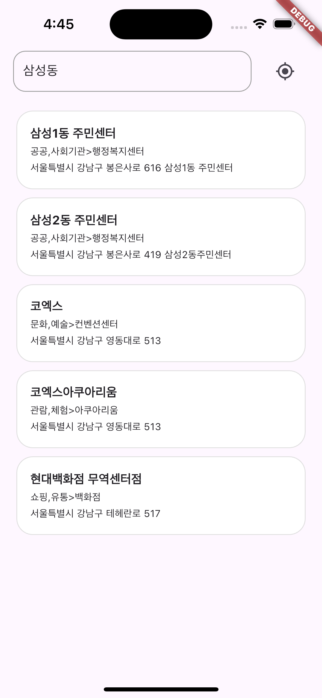

# 지역 장소 검색 앱

## 프로젝트 소개
이 프로젝트는 지역 장소 검색 Flutter 기분 어플리케이션입니다. 유저는 검색어를 입력 또는 현재 위치 정보를 이용해 지역의 장소를 검색할 수 있습니다. 

## 스크린샷
<div style="display: flex; overflow-x: auto; border: 2px solid #ccc; padding: 6px; border-radius: 8px;">  
   
    
    
    
  </div>

## 주요 기능
- **검색어 입력 및 검색**: 검색어를 입력하여 검색어로 네이버 검색 open api 기반 검색을 할 수 있습니다.
- **현재 위치로 장소 검색**: 기기의 현재 위치를 vworld open api와 연결해 검색어를 추출하고, 검색할 수 있습니다.
- **검색 결과 리스트 표시**: 검색 결과를 리스트 형태로 보여줍니다. 해당 장소의 이름, 카테고리, 도로명 주소를 포함합니다.
- **검색 결과 장소의 웹사이트 표시**: 검색 결과 장소의 웹페이지를 보여줄 수 있습니다.

## 추가 기능
- UX 고려 기능: 검색 결과 장소의 웹사이트가 없는 경우 네이버 지도에서 해당 장소의 이름으로 검색한 결과를 보여줍니다.

## 프로젝트 구조
```
lib
└─ data                             # 데이터 
   ├─ get_current_location.dart     # 현재 위치 get
   ├─ model                         # 데이터 폴더
   │  └─ location.dart              # 장소 모델
   └─ repository                    # 레포지토리 폴더
      └─ location_repository.dart   # 장소 레포지토리
└─ main.dart                        # 앱 초기 실행 코드
└─ ui                               # 사용자 인터페이스
   ├─ detail                        # 상세 페이지
   │  └─ detail_page.dart
   └─ home                          # 홈 페이지
      ├─ home_page.dart
      ├─ home_view_model.dart
      └─ widgets
         └─ locations_information.dart
└─ util
   └─ util.dart                     # 유틸 함수

```
## 의존성 패키지
프로젝트에서 사용된 주요 패키지:
- flutter_riverpot
- dio
- geolocator

## 사용한 오픈 API
- 네이버 지역 검색 api
- VWorld 2D데이터 2.0 api
- VWorld 검색 2.0 api

## 트러블슈팅
**장소 웹페이지가 표시되지 않는 문제**
- 문제점 : https 보안이 없는 페이지를 열 수 없음
- 해결책 : 네이버 지도에서 장소 이름을 검색한 페이지를 대신 보여줌

**좌표를 이용해 도로명주소를 받아올 수 없는 문제**
- 문제점 : 올바른 국내 좌표를 사용해 요청해도 vworld 검색 api로 해당 도로명주소를 받을 수 없음
- 해결책 : 2D 데이터 api를 사용, 읍면동 주소를 요청하여 사용

